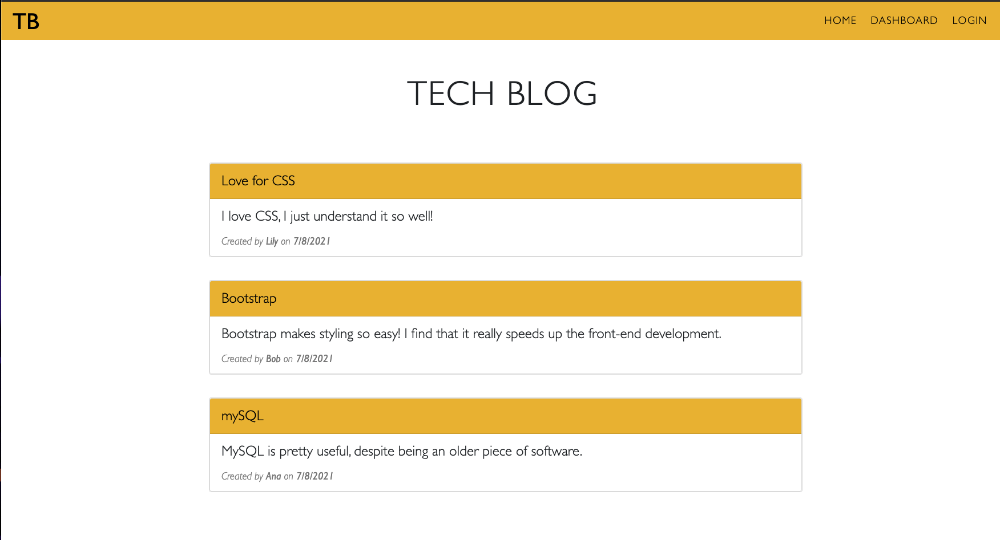

# Tech_Blog

  

  ## Description
  This application is a CMS-style blog site where users can publish their blog posts and comment on other users' posts. The structure of this blog follows the MVC paradigm in terms of its structure. It uses Handlebars.js as the templating language, Sequelize as the ORM and express-session package for authentication. Bootstrap and CSS were used for the design of the Tech Blog.

  # Table of Contents
  - [Installation Instructions](#installation-instructions)
  - [Usage Instructions](#usage)
  - [Test Instructions](#tests)
  - [Contributing](#contributing)
  - [License](#license)
  - [Questions](#questions)

  # Installation Instructions
  Clone the repository to your local device, run "node seeds/seed.js" to seed the database and "npm run start" to start the application. You'll need mySQL Workbench on your device to hold the database as well. 

  # Usage
  Run "npm run start" to start the application. The deployed version can be accessed through the above link.
  

  # Tests
  There are no tests included for this application.

  # Contributing
  There are no other contributors to this project. If you would like to contribute, please feel free to reach out to me.

  # License
  Click on the badge to learn more about this license:

  
  
  # Questions
  If you have any questions about this application, please reach out to me at: 

  - Email: analia.mohamdally@gmail.com
  - GitHub: AnaMolly, https://github.com/AnaMolly
